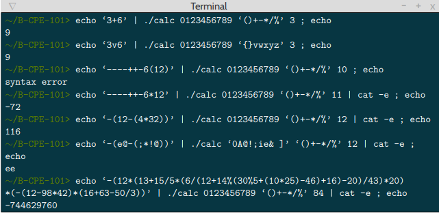

# Bistromatic

La Bistromatic est un projet de début d'année réaliser en groupe de 3, ou le but étant de créer une calculatrice, permettant le calcul de nombres infinis, et ce avec la plus grande rapidité de fonctionnement possible.

Principe de fonctionnement :

Ce programme reçoit les paramètres suivants :

    l’expression arithmétique : expression mathématique pouvant comporter une infinité d’opérations, de priorités et de nombres infinis (allant jusqu’à 100 000 digits pour les tests de notation).
    la liste des opérateurs utilisés : ()+-*/%
    la base dans laquelle est exprimée les nombres à calculer : exemples, base 2 (binaire 0 et 1), base 10 (décimal 0123456789) ou encore base 16 (hexa décimal 0123465789ABCDEF)

Ainsi la bistromatique doit gérer les opérateurs « +-*/% » ainsi que leurs priorités de calcul comme les parenthèses ainsi que les erreurs de syntaxe. Seuls des nombres entiers peuvent être rentrés (pas de nombre à virgule possible).

Ce programme doit être écrit en langage C.

## But du programme

Créer algorithme qui va effectuer des calcules complexes avec ordres de priorités.

## Fonctions autorisées

```

	• Write 
	• Malloc
	• free
	• Read 
	• Exit
```

## Mise en route

Ces instructions vous permettront d'obtenir une copie du projet opérationnel sur votre machine locale à des fins de développement et de test.

### Pré-requis

De quoi avez-vous besoin pour installer le logiciel et comment l'installer ?

```

gcc
make

```

### Installation

Compilation du projet

```
make
```

Lancement du projet

```
./calc
```

## Captures d'écrans

Exemple de lancement et de calcul :



